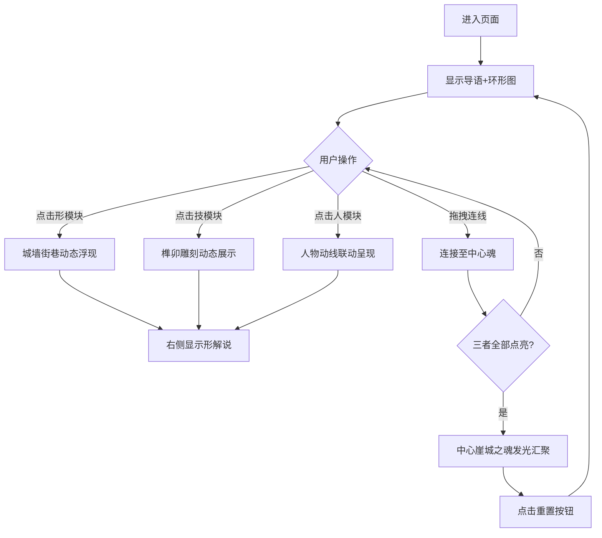

# 崖城之魂交互页面 - 产品需求文档

## 1. 产品概述

崖城之魂是「崖城风骨」数字图鉴第四部分的核心交互页面，通过环形联动可视化、立体模块交互和动态解说，直观呈现"形→技→人→魂"的文化升华逻辑。用户通过点击、悬停、拖拽等交互操作，层层递进地理解崖州古城的精神内核。

目标用户：全国大学生计算机设计大赛评审、崖州古城文化爱好者、古建筑研究者。

## 2. 核心功能

### 2.1 用户角色
| 角色 | 访问方式 | 核心权限 |
|------|----------|----------|
| 访客 | 直接访问 | 浏览全部交互内容，体验所有动画效果 |

### 2.2 功能模块
1. **中央环形可视化**：三层圆环（形、技、人）环绕中心"崖城之魂"，支持点击、缩放、联动
2. **左侧立体模块**：三个可点击的3D风格模块（古城格局、营造技艺、历史人物）
3. **右侧解说区**：动态文字说明，配合线条动画展示逻辑关系
4. **线索连线交互**：用户拖拽线条将形、技、人连接至中心魂
5. **知识点弹窗**：鼠标悬停弹出知识点说明
6. **一键回溯**：重置按钮恢复初始状态

### 2.3 页面详情
| 模块名称 | 功能描述 |
|----------|----------|
| 中央环形图 | 三层SVG圆环，可点击高亮，带动画效果 |
| 左侧模块区 | 三个立体卡片，点击触发中央环形联动 |
| 右侧解说区 | 文字+动态线条，展示三者关系 |
| 线索连线 | Canvas拖拽交互，完成逻辑匹配 |
| 知识点弹窗 | 悬停触发，显示文化知识点 |
| 重置按钮 | 一键恢复所有动画到初始状态 |

## 3. 核心流程

用户进入页面 → 看到导语和中央环形图 → 点击左侧模块或中央圆环 → 触发联动动画 → 右侧显示对应解说 → 可拖拽连线 → 全部点亮后中心发光 → 点击重置重新开始

## 4. 用户界面设计

### 4.1 设计风格
- **主色调**：深褐赭石(#8B4513) + 古金(#C9A961) + 墨黑(#1A1A1A)
- **背景**：宣纸纹理渐变(#F5F0E8 → #FFFEF9)，配合暗色区域(#2D2D2D)
- **字体**：Noto Serif SC（标题）+ Noto Sans SC（正文）
- **按钮**：圆角+渐变+阴影，hover时上浮发光
- **布局**：三栏式（左模块 | 中环形 | 右解说）
- **图标风格**：SVG线条风格，金色描边

### 4.2 页面设计
| 模块 | UI元素 |
|------|--------|
| 页面导语 | 居中排版，书法风格大字，淡入动画 |
| 中央环形 | SVG三层圆环，粒子光点，呼吸动画 |
| 左侧模块 | 3D倾斜卡片，hover发光边框 |
| 右侧解说 | 竖排文字，动态下划线，渐显动画 |
| 线索连线 | Canvas画布，可拖拽节点，连线发光 |
| 重置按钮 | 圆形，旋转图标，hover脉冲 |

### 4.3 响应式
- 桌面优先（1200px+）
- 平板（768-1199px）：三栏变为上下堆叠
- 手机（<768px）：单列布局，环形图缩放

### 4.4 动画效果
- 环形图：持续旋转+呼吸缩放
- 连线：粒子流动+发光效果
- 模块：3D翻转+光晕扩散
- 文字：逐字打印+下划线滑入
