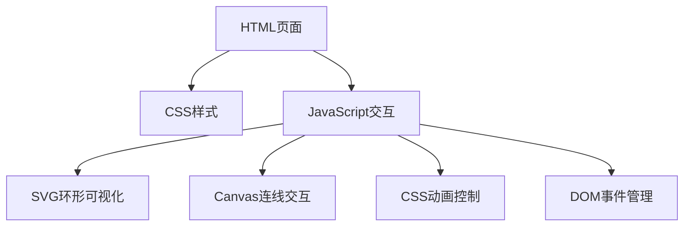

# 崖城之魂交互页面 - 技术架构文档

## 1. 架构设计



## 2. 技术描述

- **前端**：纯HTML5 + CSS3 + JavaScript（ES6+）
- **无框架**：保持与现有项目一致的技术栈
- **SVG**：用于环形可视化图
- **Canvas 2D**：用于线索连线拖拽交互
- **CSS动画**：关键帧动画 + 过渡效果
- **无后端**：纯静态页面

## 3. 文件结构

| 文件 | 用途 |
|------|------|
| pages/page-spirit.html | 主页面（替换现有文件） |
| css/spirit.css | 页面专属样式 |
| js/spirit.js | 交互逻辑脚本（替换现有文件） |

## 4. 核心模块设计

### 4.1 RingVisualization（环形可视化）
- 使用SVG绘制三层圆环
- 每层圆环包含多个扇形区域
- 点击事件触发高亮动画
- 全部激活后触发中心发光

### 4.2 ModuleCards（立体模块）
- 三个CSS 3D变换卡片
- 点击触发对应环形高亮
- hover时3D倾斜+光晕

### 4.3 ConnectionLines（线索连线）
- Canvas 2D绘制可拖拽节点
- 贝塞尔曲线连接
- 粒子流动动画

### 4.4 TooltipSystem（知识点弹窗）
- 鼠标悬停检测
- 动态定位弹窗
- 渐入渐出动画

### 4.5 AnimationController（动画控制器）
- 管理所有动画状态
- 提供重置功能
- 协调各模块联动

## 5. 数据模型

```javascript
// 维度数据
const dimensions = {
  shape: {
    name: '形',
    title: '古城格局',
    subtitle: '空间载体',
    color: '#8B4513',
    description: '形承载空间格局...',
    items: ['城池形制', '街巷肌理', '空间布局']
  },
  tech: {
    name: '技',
    title: '营造技艺',
    subtitle: '匠心智慧',
    color: '#D2691E',
    description: '技凝聚匠心智慧...',
    items: ['榫卯工艺', '雕刻技法', '建筑智慧']
  },
  people: {
    name: '人',
    title: '历史人物',
    subtitle: '人文底蕴',
    color: '#CD853F',
    description: '人注入人文底蕴...',
    items: ['名臣谪贤', '本土先民', '商旅百姓']
  },
  soul: {
    name: '魂',
    title: '崖城之魂',
    subtitle: '精神内核',
    color: '#C9A961',
    description: '三者共同凝练崖城精神内核'
  }
};
```

## 6. 性能考虑

- Canvas使用requestAnimationFrame优化动画
- CSS动画优先使用transform和opacity
- 事件委托减少监听器数量
- 图片懒加载（如有）
